# 🌍 COVID-19 Global Data Analysis & Visualization

<p align="center">
  
  
  
  
  
  
</p>

<p align="center">
  <a href="https://github.com/mukherjeesourav687/COVID19-Global-Data-Analysis">
    
  </a>
  <a href="https://www.linkedin.com/in/mukherjeesourav687/">
    
  </a>
</p>

<p align="center">
<strong>End-to-End COVID-19 Data Analysis Project</strong><br>
Data Cleaning • Exploratory Data Analysis • Time-Series Analysis • Recovery & Fatality Metrics • Data Visualization
</p>

---

# 📊 Project Snapshot

| Metric            | Value                             |
| ----------------- | --------------------------------- |
| Dataset Coverage  | 180+ Countries                    |
| Time Period       | 2020 – 2021                       |
| Records Processed | 36,556+                           |
| Visualizations    | 10+                               |
| Technologies Used | Python, Pandas, NumPy, Matplotlib |
| Analysis Type     | EDA & Time-Series Analysis        |

---

# 📌 Overview

This project transforms raw multi-sheet COVID-19 datasets into meaningful analytical insights.

The analysis covers:

* Confirmed Cases
* Deaths
* Recoveries
* Recovery Rate Analysis
* Case Fatality Rate (CFR)
* Country Comparisons
* Monthly Progression Analysis
* Time-Series Visualization

The goal is to demonstrate practical data analytics skills including cleaning, transformation, feature engineering, exploratory analysis, and visualization.

---

# 📈 Featured Visualization

## Top 10 Countries by Confirmed Cases

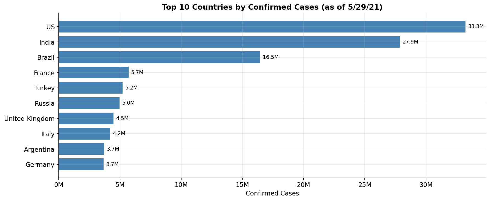

---

# 🎯 Problem Statement

COVID-19 datasets are often distributed across multiple sheets and contain:

* Wide-format date columns
* Missing values
* Inconsistent formats
* No derived analytical metrics

This project addresses key analytical questions:

* Which countries experienced the highest infection rates?
* How did deaths and recoveries evolve over time?
* Which countries exhibited the highest recovery rates?
* What trends emerged during different pandemic phases?
* How can raw public-health data be transformed into actionable insights?

---

# 🚀 Key Features

✅ Data Cleaning & Preprocessing

✅ Missing Value Handling

✅ Wide-to-Long Data Transformation

✅ Multi-Sheet Dataset Integration

✅ Exploratory Data Analysis (EDA)

✅ Time-Series Analysis

✅ Recovery Rate Analysis

✅ Case Fatality Rate Analysis

✅ Country-Level Comparisons

✅ Professional Data Visualizations

✅ Insight Generation & Reporting

---

# 🛠️ Tech Stack

| Technology       | Purpose                      |
| ---------------- | ---------------------------- |
| Python           | Programming Language         |
| Pandas           | Data Manipulation & Analysis |
| NumPy            | Numerical Computation        |
| Matplotlib       | Data Visualization           |
| OpenPyXL         | Excel Processing             |
| Jupyter Notebook | Interactive Analysis         |

---

# 💡 Skills Demonstrated

* Data Cleaning
* Data Wrangling
* Feature Engineering
* Exploratory Data Analysis (EDA)
* Time Series Analysis
* Statistical Analysis
* Data Visualization
* Pandas
* NumPy
* Matplotlib
* Jupyter Notebook
* Data Storytelling

---

# 📂 Project Structure

```text
COVID19-Global-Data-Analysis/
│
├── data/
│   ├── covid_19_dataset.xlsx
│   └── merged_clean.csv
│
├── images/
│   ├── 2b_top10_countries_confirmed.png
│   ├── 2c_china_confirmed_trends.png
│   ├── 5a_peak_daily_confirmed_germany_france_italy.png
│   ├── 5b_recovery_rate_canada_australia.png
│   ├── 5c_canada_deaths_cfr.png
│   ├── 6c_top5_avg_daily_deaths.png
│   ├── 6d_us_deaths_evolution.png
│   ├── 7b_monthly_progression_us_italy_brazil.png
│   ├── 8a_top3_avg_daily_deaths_2020.png
│   ├── 8b_south_africa_recoveries.png
│   └── 8c_us_monthly_recovery_ratio.png
│
├── notebooks/
│   └── COVID19_Case_Study.ipynb
│
├── insights_summary.txt
├── requirements.txt
└── README.md
```

---

# 📋 Data Processing Workflow

```text
Raw Excel Data
      ↓
Data Cleaning
      ↓
Wide-to-Long Transformation
      ↓
Dataset Merging
      ↓
Feature Engineering
      ↓
EDA & Time-Series Analysis
      ↓
Visualization
      ↓
Insights & Conclusions
```

---

# 📊 Key Findings

| Metric                      | Finding          |
| --------------------------- | ---------------- |
| Highest Confirmed Cases     | USA (33.3M)      |
| Second Highest Cases        | India (27.9M)    |
| Third Highest Cases         | Brazil (16.5M)   |
| Highest Avg Daily Deaths    | USA (12,784/day) |
| Strong Recovery Performance | Australia        |

---

## Top Countries by Average Daily Deaths

| Rank | Country        | Avg Daily Deaths |
| ---- | -------------- | ---------------- |
| 1    | USA            | 12,784           |
| 2    | Brazil         | 10,175           |
| 3    | India          | 5,974            |
| 4    | Mexico         | 5,068            |
| 5    | United Kingdom | 2,847            |

---

# 📈 Visualizations

### Top 10 Countries by Confirmed Cases


### China Confirmed Cases Trend

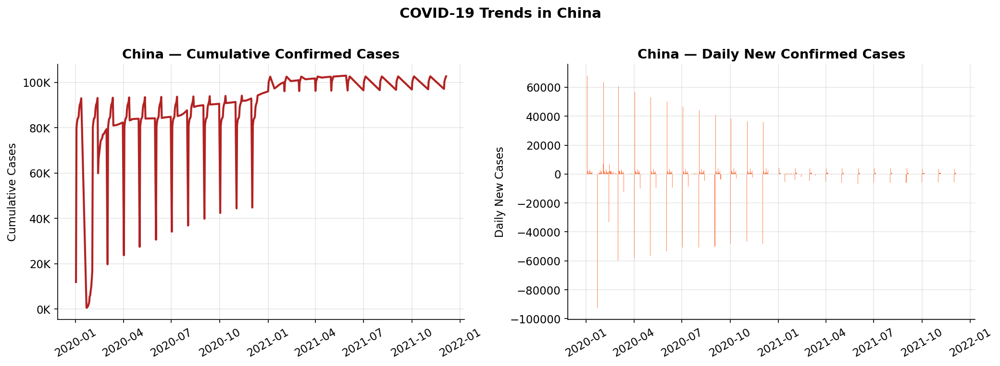

### Peak Daily Cases — Germany, France, Italy

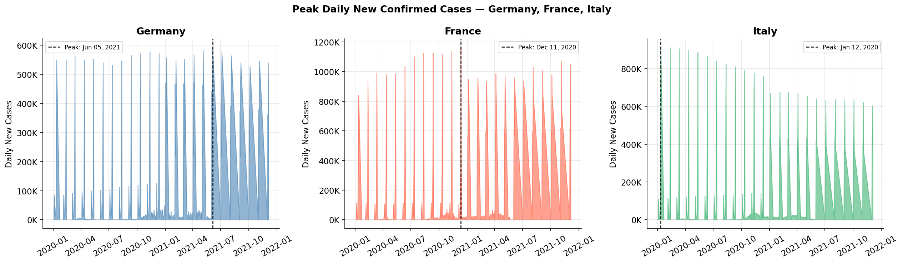

### Recovery Rate Comparison — Canada vs Australia

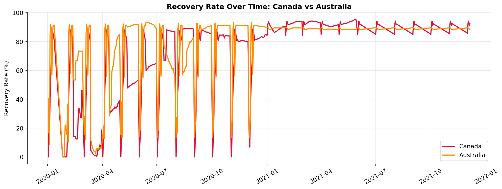

### Case Fatality Analysis — Canada

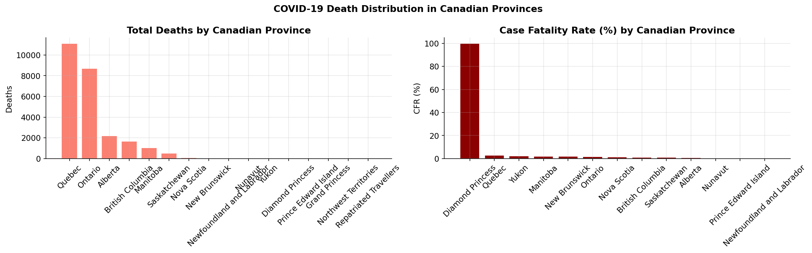

### Top 5 Countries by Average Daily Deaths

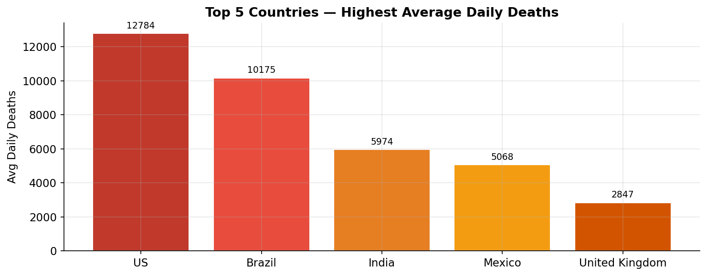

### United States Death Evolution

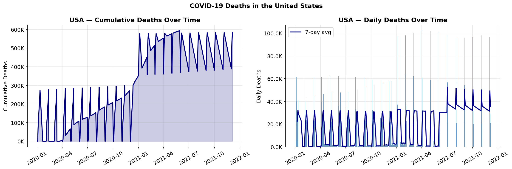

### Monthly Progression Analysis

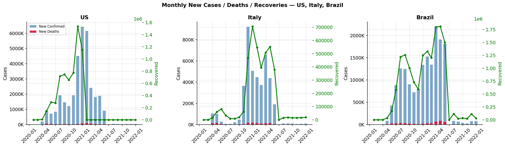

### Top 3 Countries by Average Daily Deaths (2020)

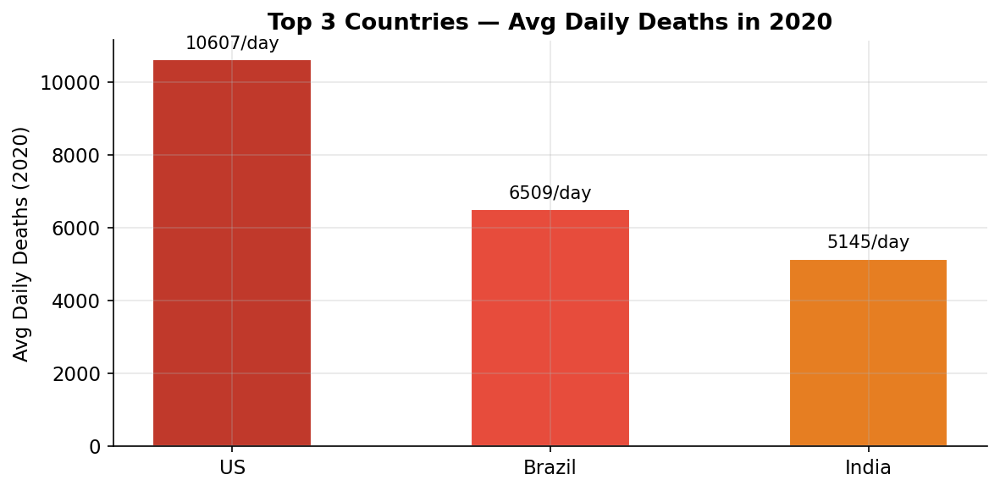

### South Africa Recovery Trend

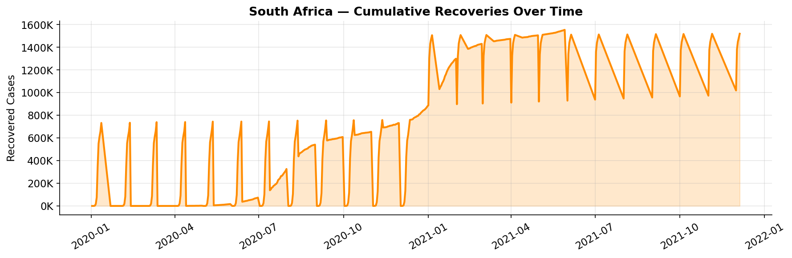

### USA Monthly Recovery Ratio

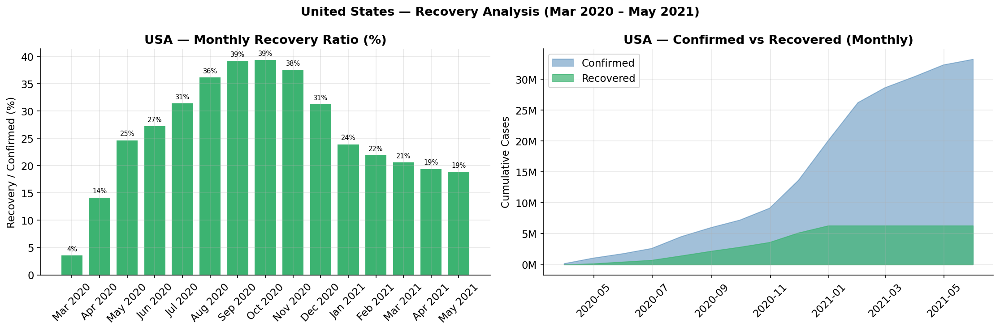

---

# ⚠️ Challenges Solved

| Challenge                  | Solution                              |
| -------------------------- | ------------------------------------- |
| Wide-format date columns   | Reshaped using `pd.melt()`            |
| Cumulative → Daily metrics | Calculated using `.diff()`            |
| Multi-sheet integration    | Merged datasets using common keys     |
| Missing values             | Forward-fill strategy                 |
| Date inconsistencies       | Standardized using `pd.to_datetime()` |
| Rate calculations          | Vectorized feature engineering        |

---

# ▶️ Run Locally

```bash
git clone https://github.com/mukherjeesourav687/COVID19-Global-Data-Analysis.git

cd COVID19-Global-Data-Analysis

pip install -r requirements.txt

jupyter notebook
```

Open:

```text
notebooks/COVID19_Case_Study.ipynb
```

and run all cells.

---

# 🚀 Future Improvements

* Interactive Power BI Dashboard
* Tableau Dashboard
* Streamlit Web Application
* Per-Capita Analysis
* Vaccination Impact Analysis
* Geospatial Mapping
* Forecasting with ARIMA / Prophet

---

# 👨‍💻 Author

## Sourav Mukherjee

**Aspiring Data Analyst | Python Developer | Data Visualization Enthusiast**

📧 Email: [mukherjeesourav687@gmail.com](mailto:mukherjeesourav687@gmail.com)

🔗 LinkedIn: https://www.linkedin.com/in/mukherjeesourav687/

🔗 GitHub: https://github.com/mukherjeesourav687

---

# ⭐ Support the Project

If you found this project useful:

⭐ Star the repository

🍴 Fork the repository

📢 Share it with others

Your support helps improve future open-source analytics projects.

---

<p align="center">
Made with ❤️ by Sourav Mukherjee
</p>
